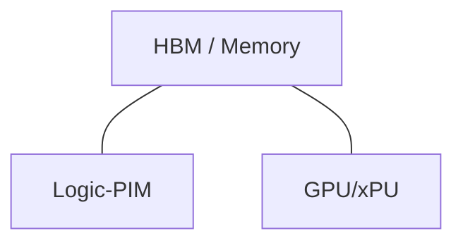

# Duplex Architecture Performance Reproduction

## SLIDE 1 — TITLE
**Duplex Architecture Performance Reproduction**
A System-Level Validation of Expert-Tensor Parallelism and Logic-PIM for MoE Inference

## SLIDE 2 — PROBLEM
**MoE Inference and the Memory Wall**
- Large expert weights lead to massive memory capacity and bandwidth requirements.
- Top-k routing (e.g., Top-2) causes sparse activation patterns.
- Moving expert weights from HBM to compute units becomes the primary bottleneck (low Op/B).
- Memory bandwidth fundamentally limits decode throughput.

## SLIDE 3 — MIXTRAL MODEL
**Mixtral-8x7B (47B Total Parameters)**
- 32 MoE layers, 8 routed experts per layer
- Top-k = 2 routing
- 32 attention heads, 8 KV heads
- Hidden dimension = 4096, Intermediate dimension = 14336
- Precision: FP16
- *Significance*: Although total parameters are 47B, only ~13B are active per token, heavily stressing memory access over dense compute.

## SLIDE 4 — WORKLOAD
**Controlled Decode Microbenchmark**
- 32 concurrent requests
- input_len = 2048, output_len = 128
- prefill_mode = OFF (Decode-only simulation)
- 5 measured decode iterations generating 32 new tokens per step.
- Warm-up: 10,000 unmeasured scheduler hitting-queue iterations to reach steady state.
- **Trace Output**: 160 newly processed tokens resulting in 10,240 detailed routing records.

## SLIDE 5 — HARDWARE
**Simulated Hardware Configuration**
- 1 Node, 4 H100-equivalent devices (80 GB HBM3 per device, 5.2Gbps)
- NVLink Gen 5 interconnect
- Tensor Parallelism (TP) = 4, Data Parallelism (DP) = 1
- **Duplex specific**: Devices augmented with Logic-PIM capabilities for near-memory compute.

## SLIDE 6 — DUPLEX ARCHITECTURE
**Conceptual Architecture**

- **High-Op/B work** (Dense Attention, Communication) → xPU
- **Memory-intensive / Low-Op/B work** (MoE Experts) → Logic-PIM

## SLIDE 7 — FOUR EXPERIMENTS
**Experimental Progression**
1. **GPU Baseline**: Standard GPU execution (TP=4).
2. **Plain Duplex**: Logic-PIM enabled for all MoE layers.
3. **Duplex + PE**: Processing Element (PE) enabled for dynamic processor shifting.
4. **Duplex + PE + ET**: Expert Tensor Parallelism (ET=4) sharding experts across all 4 devices.

## SLIDE 8 — ROUTING
**Routing Consistency Example**
- Request 2624, Token 2142, Layer 0
  - → Expert 1
  - → Expert 5
- *Note*: request ≠ token ≠ expert. 
- Validation confirms that the exact same token-level routing decisions were made across all four hardware configurations.

## SLIDE 9 — ROUTING RESULTS
**Routing Behavior Observations**
- **Expert frequency**: Highly skewed. Some experts handle 40%+ of traffic while others sit idle.
- **Routing balance**: Severe spatial imbalance across the 8 experts.
- **Temporal correlation**: High likelihood of a token routing to the same expert in consecutive layers.
*Conclusion*: Static expert assignment (ET=1) leads to massive device load imbalance.

## SLIDE 10 — GPU BASELINE
**GPU Execution Breakdown**
- **MoE Execution**: ~6.76 ms (Dominant bottleneck)
- **Attention**: ~0.69 ms
- **Communication**: ~0.33 ms
- Total Time: ~32.09 ms
- *Conclusion*: Memory bandwidth limits the GPU when fetching heavy expert weights.

## SLIDE 11 — DUPLEX RESULTS
**Duplex vs GPU Baseline**
- **MoE Execution**: Reduced from 6.76 ms to 2.14 ms.
- **Total Time**: Reduced from 32.09 ms to 11.57 ms (2.77x speedup).
- *Mechanism*: Logic-PIM eliminates the need to move large expert weights across the memory bus, fundamentally shifting the bottleneck away from MoE memory pressure.

## SLIDE 12 — PE RESULTS
**Duplex vs Duplex+PE**
- **Performance**: 11.57 ms (No net change).
- *Mechanism*: PE dynamically monitors Op/B. It correctly identified that Attention should remain on GPU and MoE on Logic-PIM. For this specific workload, no expert layers crossed the threshold to migrate back to the GPU, confirming that Logic-PIM was the optimal assignment for all experts.

## SLIDE 13 — ET RESULTS
**Duplex+PE vs Duplex+PE+ET**
- **Total Time**: Reduced from 11.57 ms to 10.47 ms (Additional 1.1x speedup vs Duplex, 3.06x overall vs GPU).
- *Mechanism*: Expert Tensor Parallelism (ET=4) shards every expert across all 4 devices. 
- *Trade-off*: MoE compute time drops significantly (2.14 ms → 1.71 ms) due to perfect device load balancing, at the cost of slightly higher communication overhead (0.33 ms → 0.50 ms).

## SLIDE 14 — DEVICE TOPOLOGY
**Device-Aware Trace Validation**
- **ET=1 (Plain Duplex)**: Whole experts assigned to specific devices. (e.g., `expert_FFN_4` executes exclusively on `device_2`). Highly imbalanced if Expert 4 is popular.
- **ET=4 (Duplex+PE+ET)**: Every expert is computed collaboratively across all 4 devices. `expert_FFN_4` appears in the trace for devices 0, 1, 2, and 3. Perfect balance.

## SLIDE 15 — PERFORMANCE SUMMARY
| Configuration | Total Time (ms) | Throughput (tok/s) | Speedup vs GPU | MoE (ms) | Comm (ms) | Energy (mJ) |
|---|---|---|---|---|---|---|
| GPU Baseline | 32.09 | 4.99 | 1.00x | 6.76 | 0.33 | 3136.88 |
| Duplex | 11.57 | 13.83 | 2.77x | 2.14 | 0.33 | 3340.54 |
| Duplex + PE | 11.57 | 13.83 | 2.77x | 2.14 | 0.33 | 3340.54 |
| Duplex + PE + ET | 10.47 | 15.28 | 3.06x | 1.71 | 0.50 | 3305.61 |

## SLIDE 16 — WHY PERFORMANCE CHANGED
**Cause and Effect**
1. **GPU**: Memory bandwidth throttles MoE.
2. **Duplex**: Logic-PIM absorbs MoE memory pressure → Huge gain.
3. **PE**: Dynamic validation of assignments → Optimal stable state reached.
4. **ET**: Shards experts to resolve routing skew → Balances device utilization → Net positive gain despite all-reduce overhead.

## SLIDE 17 — LIMITATIONS
- Simulated decode-only microbenchmark.
- Highly specific 32-request concurrency and 5-step depth.
- Results represent a modeled hardware environment, not physical silicon measurement.
- ET speedup is highly sensitive to the exact latency/bandwidth of the NVLink Gen 5 interconnect.
- Routing locality and skew are heavily dependent on the specific prompt distribution.

## SLIDE 18 — FINAL CONCLUSION
1. **Logic-PIM is highly effective**: Offloading memory-bound MoE layers to Logic-PIM yields a 2.77x throughput increase.
2. **Routing skew is severe**: MoE expert popularity is uneven, causing device-level stragglers in ET=1 configurations.
3. **ET perfectly balances load**: Sharding experts (ET=4) eliminates device stragglers and reduces runtime to 10.47 ms (3.06x overall speedup).
4. **Simulator Validation**: Comprehensive processor tracing mathematically confirms that device topologies and processor assignments behave precisely as theoretically modeled.
